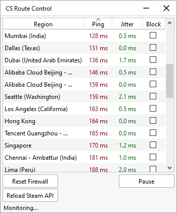
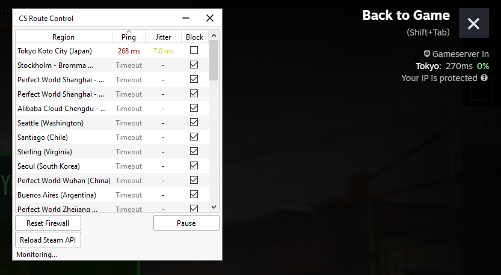

# CS Route Control
CS Route Control is a native Windows utility for managing Counter-Strike 2 matchmaking connections. It configures Windows Firewall outbound rules to block specific Steam Datagram Relay (SDR) regions, giving you full control over which servers you connect to. Built natively in C++17 and Qt6.

<p align="center">
  
</p>

## Usage Instructions

1. Navigate to the **[Releases](../../releases)** section and download the latest compiled archive.
2. Extract the contents to a local directory.
3. Execute `route_control.exe` **as Administrator** (elevated privileges are required to modify Windows Firewall policies).
4. Use the interface checkboxes to toggle block states for specific regions.
5. Selection Mode: Isolate a single region instantly by using <kbd>Alt</kbd> + <kbd>Left Click</kbd> or <kbd>Middle Mouse Click</kbd> on a region, which automatically blocks all other available locations.

<p align="center">
  
</p>

## Building from Source

Built and tested with MSYS2 (UCRT64) on Windows.


### Environment Setup (MSYS2)


```bash
pacman -S mingw-w64-ucrt-x86_64-toolchain mingw-w64-ucrt-x86_64-cmake mingw-w64-ucrt-x86_64-qt6-base
```

### Build

```bash
mkdir build && cd build
cmake .. -G "Ninja" -DCMAKE_BUILD_TYPE=Release
cmake --build .
```
